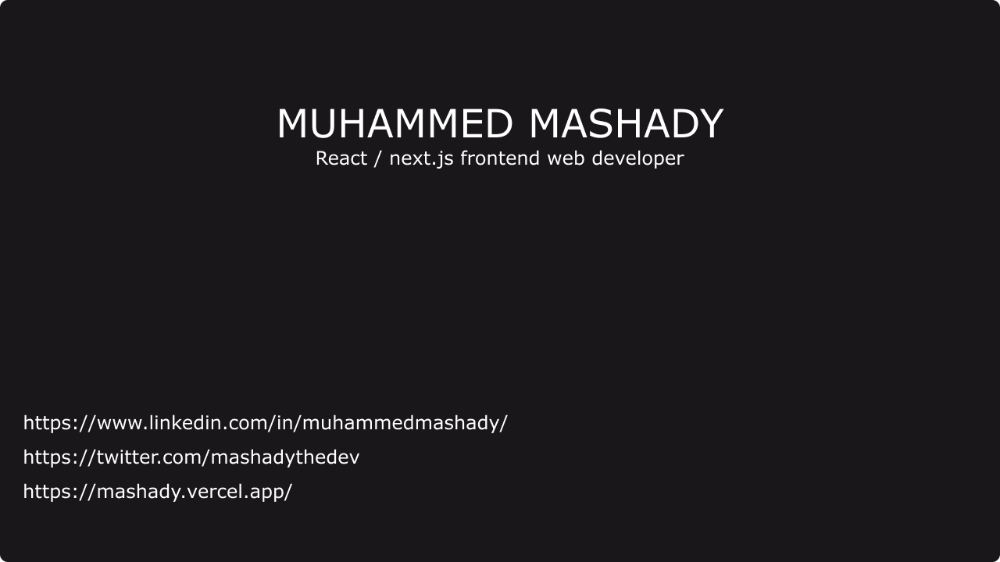

<h3 align="center">Crafting Digital and Web Developer</h3>

  

- 🌱 I’m currently learning **react / next.js**

- 👨‍💻 All of my projects are available at [https://mashady.vercel.app/](https://mashady.vercel.app/)

- 📝 I regularly write articles on [https://www.linkedin.com/in/muhammedmashady/](https://www.linkedin.com/in/muhammedmashady/)

- 💬 Ask me about **react / next.js**

- 📫 How to reach me **muhammedmashady@gmail.com**

- 📄 Know about my experiences [https://drive.google.com/file/d/1whezTGGNs8Cm061y\_-g5A9tJPYOmGO8c/view?usp=sharing](https://drive.google.com/file/d/1whezTGGNs8Cm061y_-g5A9tJPYOmGO8c/view?usp=sharing)

<h3 align="left">Languages and Tools:</h3>

 

  

